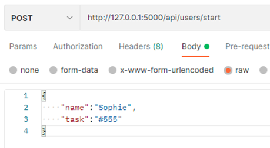
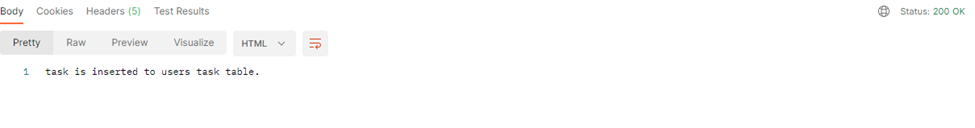
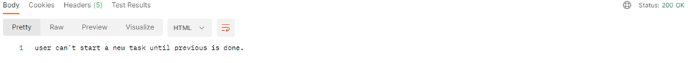
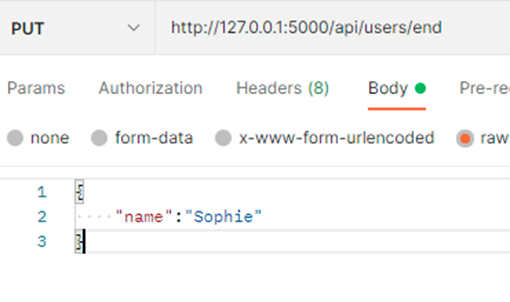
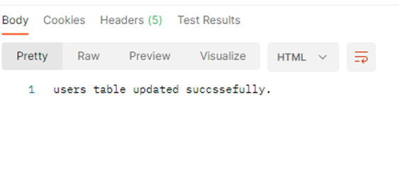
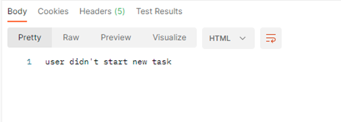
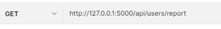
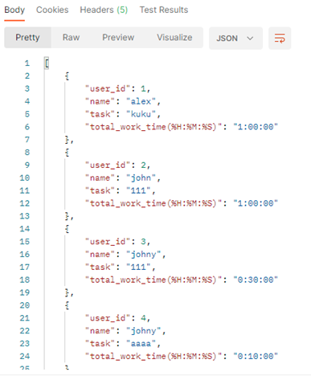

1)	Open desktop postman.
2)	Run the code.
3)	We have 3 type of requests:
(1)	Start request = Post mode
(2)	End request = Put mode
(3)	Report request = Get mode

(1)	Start request should contain only username and the task

The output response for this request:

Sending another start request with the same username before sending end request will give the next response:

(2)	End request should contain only username:

The output response:

Sending another end request for the same username will give the next response:

(3)	Report request: In this request there is no “body” part for the request.
Sending “Get” request to get the whole report for all the user ids in the database table:

The response:

